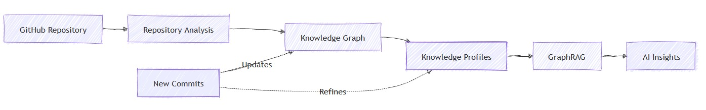

<<<<<<< HEAD
# React + TypeScript + Vite

This template provides a minimal setup to get React working in Vite with HMR and some ESLint rules.

Currently, two official plugins are available:

- [@vitejs/plugin-react](https://github.com/vitejs/vite-plugin-react/blob/main/packages/plugin-react) uses [Oxc](https://oxc.rs)
- [@vitejs/plugin-react-swc](https://github.com/vitejs/vite-plugin-react/blob/main/packages/plugin-react-swc) uses [SWC](https://swc.rs/)

## React Compiler

The React Compiler is not enabled on this template because of its impact on dev & build performances. To add it, see [this documentation](https://react.dev/learn/react-compiler/installation).

## Expanding the ESLint configuration

If you are developing a production application, we recommend updating the configuration to enable type-aware lint rules:

```js
export default defineConfig([
  globalIgnores(['dist']),
  {
    files: ['**/*.{ts,tsx}'],
    extends: [
      // Other configs...

      // Remove tseslint.configs.recommended and replace with this
      tseslint.configs.recommendedTypeChecked,
      // Alternatively, use this for stricter rules
      tseslint.configs.strictTypeChecked,
      // Optionally, add this for stylistic rules
      tseslint.configs.stylisticTypeChecked,

      // Other configs...
    ],
    languageOptions: {
      parserOptions: {
        project: ['./tsconfig.node.json', './tsconfig.app.json'],
        tsconfigRootDir: import.meta.dirname,
      },
      // other options...
    },
  },
])

```

You can also install [eslint-plugin-react-x](https://github.com/Rel1cx/eslint-react/tree/main/packages/plugins/eslint-plugin-react-x) and [eslint-plugin-react-dom](https://github.com/Rel1cx/eslint-react/tree/main/packages/plugins/eslint-plugin-react-dom) for React-specific lint rules:

```js
// eslint.config.js
import reactX from 'eslint-plugin-react-x'
import reactDom from 'eslint-plugin-react-dom'

export default defineConfig([
  globalIgnores(['dist']),
  {
    files: ['**/*.{ts,tsx}'],
    extends: [
      // Other configs...
      // Enable lint rules for React
      reactX.configs['recommended-typescript'],
      // Enable lint rules for React DOM
      reactDom.configs.recommended,
    ],
    languageOptions: {
      parserOptions: {
        project: ['./tsconfig.node.json', './tsconfig.app.json'],
        tsconfigRootDir: import.meta.dirname,
      },
      // other options...
    },
  },
])

```
=======
<div align="center">

# 🚀 RepoSense
### Software Evolution Intelligence Platform

<p>
Transforming software repositories into a living architectural knowledge graph.
</p>



<br>


</div>

---

# 📖 Overview

RepoSense is an **AI-powered Software Evolution Intelligence Platform** that transforms Git repositories into a continuously evolving **Knowledge Graph**.

Instead of treating source code as isolated files, RepoSense preserves the **architectural memory** of an entire software project by combining:

- Git History
- Pull Requests
- AST Parsing
- Repository Structure
- Developer Intent
- Knowledge Graphs
- GraphRAG

The result is an intelligent system capable of explaining **what changed, why it changed, what it impacts, and how the architecture evolved over time.**

---

# ❓ Problem Statement

Modern repositories lose valuable architectural knowledge over time.

Common challenges include:

- Git records **what changed**, not **why**
- Architectural decisions disappear when developers leave
- AI coding assistants lack repository-wide architectural understanding
- Code reviews focus on changed lines rather than historical impact
- Hidden downstream dependencies remain invisible until production failures

RepoSense addresses these challenges by preserving architectural intent as a continuously evolving graph.

---

# 💡 Solution

RepoSense converts repository artifacts into an interconnected Knowledge Graph where:

- Every file becomes connected
- APIs know their dependencies
- Developers retain architectural context
- Historical reasoning is preserved
- AI retrieves grounded answers using GraphRAG instead of relying solely on LLM memory

Unlike traditional AI coding assistants, deterministic parsing constructs repository memory while the LLM focuses on interpretation.

---

# ⚙️ Architecture

```

                GitHub Repository
                        │
                        ▼
          Repository Intelligence Layer
      ┌─────────────────────────────────┐
      │                                 │
Git History                    Static Code Parsing
(PyDriller)                   (Tree-sitter / JavaParser)
      │                                 │
      └──────────────┬──────────────────┘
                     ▼
              Graph Builder Engine
                     │
                     ▼
             Neo4j Knowledge Graph
                     │
      ┌──────────────┼──────────────┐
      ▼              ▼              ▼
 Graph APIs     Analytics      AI Reasoning
                     │
                     ▼
             FastAPI Backend APIs
                     │
      ┌──────────────┼──────────────┐
      ▼              ▼              ▼
 Dashboard      Graph Viewer     AI Chat
```

---

# ⭐ Core Features

<table>

<tr>

<th width="25%">Feature</th>
<th>Description</th>

</tr>

<tr>

<td><b>Interactive Knowledge Graph</b></td>

<td>

Visualize repository architecture through an interactive graph of files, classes, APIs, developers, and dependencies.

</td>

</tr>

<tr>

<td><b>Intent Extraction</b></td>

<td>

Recover architectural reasoning and design intent from commits and pull requests using GraphRAG.

</td>

</tr>

<tr>

<td><b>Impact Analysis</b></td>

<td>

Predict downstream effects of source code changes before merging pull requests.

</td>

</tr>

<tr>

<td><b>Regression Intelligence</b></td>

<td>

Identify code hotspots, flaky tests, regression patterns, and long-term architectural risks.

</td>

</tr>

</table>

---

# 📊 Technology Stack

<table>

<tr>

<th>Layer</th>
<th>Technology</th>

</tr>

<tr>

<td>Frontend</td>

<td>React, TailwindCSS, React Flow / Cytoscape.js</td>

</tr>

<tr>

<td>Backend</td>

<td>FastAPI, Python</td>

</tr>

<tr>

<td>Graph Database</td>

<td>Neo4j, Cypher</td>

</tr>

<tr>

<td>Repository Mining</td>

<td>PyDriller</td>

</tr>

<tr>

<td>Static Analysis</td>

<td>Tree-sitter, JavaParser</td>

</tr>

<tr>

<td>Knowledge Graph</td>

<td>Neo4j</td>

</tr>

<tr>

<td>AI</td>

<td>Gemini API</td>

</tr>

<tr>

<td>Reasoning</td>

<td>GraphRAG</td>

</tr>

</table>

---

# 🔮 Future Roadmap

- Multi-language repository support
- Automatic architecture diagrams
- Repository timeline visualization
- AI-generated design documentation
- CI/CD integration
- GitHub App deployment
- Pull Request Copilot
- Enterprise multi-repository knowledge graph

---

# 👥 Team

<div align="center">

### Team Pav Bhaji

**RepoSense — Software Evolution Intelligence Platform**

Quantum Arena '26

</div>

---

# 📄 License

This project is developed for **Quantum Arena '26 Hackathon**.

---

<div align="center">

### ⭐ Don't Search Code. Search Knowledge.

</div>
>>>>>>> main
